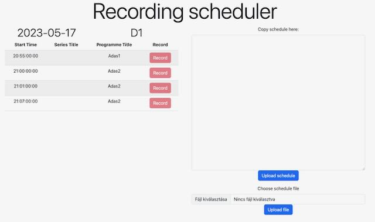

# Fix ascpect ratio

### Prerequisites

Install <a href="https://ffmpeg.org/download.html">ffmpeg</a> and <a href="https://www.python.org/downloads/release/python-3113/">Python</a>.

### Usage

The ffmpeg script itself is in the convert.sh and convert.bat files. Both can convert mpg file to mp4 file.

On Linux/MacOS:
```
sh convert.sh input.mpg output.mp4
```
On Windows (PowerShell):
```
./convert.bat input.mpg output.mp4
```
The Python script uses an input file for inputs and outputs and uses the same ffmpeg script for the converting what in the convert.sh and convert.bat files. For the input file use the syntax of convert.txt:
```
input1.mpg output1.mp4
input2.mpg output2.mp4
```
Then you can run the Python script with the following command:
```
python convert.py convert.txt
```
# Recording scheduler

### Prerequisites

Install <a href="https://www.java.com/en/download/">Java</a> and <a href="https://maven.apache.org/install.html">Maven</a>.

### Usage

Before running the application please fill the application.properties file with your variables:
```
schedule.json.path=<folder-of-uploaded-json-schedules>
recording.logfile.path=<full-path-of-logfile>
recording.start.url=<start-command-url>
recording.stop.url=<stop-command-url>
recording.puffer.before=<before-recording-buffer-in-timecode>
recording.puffer.after=<after-recording-buffer-in-timecode>
```
The channelID will be after the start and stop URLs. If you don't write over these, the original URLs are behave like test endpoints and indicates the start and stop commands:
```
Start command received on channel D1.
Stop command received on channel D1.
```
Run the following commands in the *recording-scheduler* main application folder:
```
mvn package
java -jar target/recording-scheduler-0.0.1-SNAPSHOT.war
```
Then the web application starts on http://localhost:8080/.


In the large textbox you can paste proper json schedule, or you can upload one under it. For the text and the file upload there are dedicated buttons under the input fields. The schedule will be on the left side of the page. Only one schedule can be loaded at a time, and you can add a recording task, if you click the *Record* button next to the schedule event. After you clicked, the button will be disabled, because an event can be registered only once for recording.